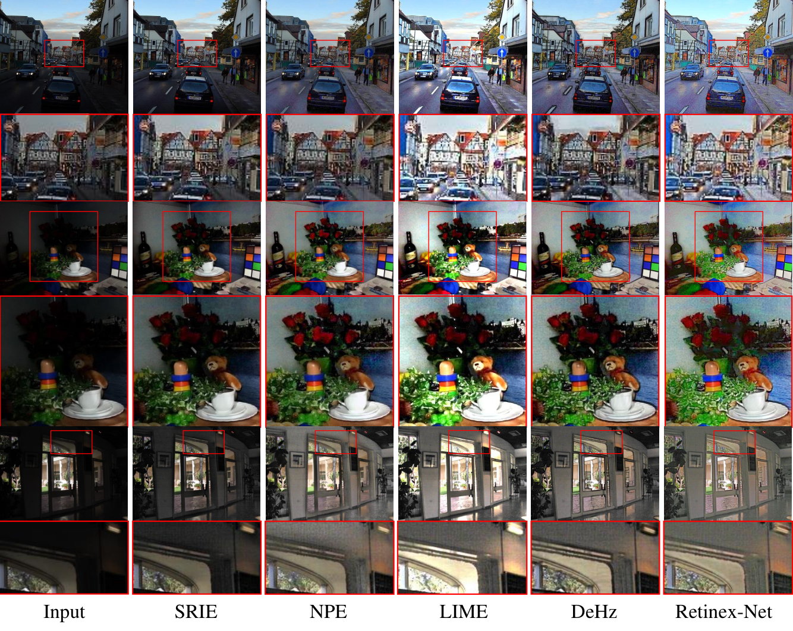

# RetinexNet
This is a Tensorflow implement of RetinexNet

Deep Retinex Decomposition for Low-Light Enhancement. In BMVC'18 (Oral Presentation)<br>
[Chen Wei*](https://weichen582.github.io/), [Wenjing Wang*](https://daooshee.github.io/website/), [Wenhan Yang](https://flyywh.github.io/), [Jiaying Liu](http://www.icst.pku.edu.cn/struct/people/liujiaying.html). (* indicates equal contributions)<br>

[Paper](https://arxiv.org/abs/1808.04560), [Project Page & Dataset](https://daooshee.github.io/BMVC2018website/)



### Requirements ###
1. Python
2. Tensorflow >= 1.5.0
3. numpy, PIL

### Testing  Usage ###
To quickly test your own images with our model, you can just run through
```shell
python main.py 
    --use_gpu=1 \                           # use gpu or not
    --gpu_idx=0 \
    --gpu_mem=0.5 \                         # gpu memory usage
    --phase=test \
    --test_dir=/path/to/your/test/dir/ \
    --save_dir=/path/to/save/results/ \
    --decom=0                               # save only enhanced results or together with decomposition results
```
Or you can just see some demo cases by
```shell
python main.py --phase=test
```
, the results will be saved under ```./test_results/```.

### Training Usage ###
First, download training data set from [our project page](https://daooshee.github.io/BMVC2018website/). Save training pairs of our LOL dataset under `./data/our485/`, and synthetic pairs under `./data/syn/`.
Then, just run
```shell
python main.py
    --use_gpu=1 \                           # use gpu or not
    --gpu_idx=0 \
    --gpu_mem=0.5 \                         # gpu memory usage
    --phase=train \
    --epoch=100 \                           # number of training epoches
    --batch_size=16 \
    --patch_size=48 \                       # size of training patches
    --start_lr=0.001 \                      # initial learning rate for adm
    --eval_every_epoch=20 \                 # evaluate and save checkpoints for every # epoches
    --checkpoint_dir=./checkpoint           # if it is not existed, automatically make dirs
    --sample_dir=./sample                   # dir for saving evaluation results during training
 ```
 Tips:
 1. The model is quite small, so it will take just minutes to finish the training procedure if you are using GPU. For people who are using CPU, it is also affordable.
 2. The enhancement performance is highly dependent on training parameters. So if you change the default parameters, you might get some weird results.
 
 ### Citation ###
 ```
 @inproceedings{Chen2018Retinex,
  title={Deep Retinex Decomposition for Low-Light Enhancement},
  author={Chen Wei, Wenjing Wang, Wenhan Yang, Jiaying Liu},
  booktitle={British Machine Vision Conference},
  year={2018},
  organization={British Machine Vision Association}
}
```
 
